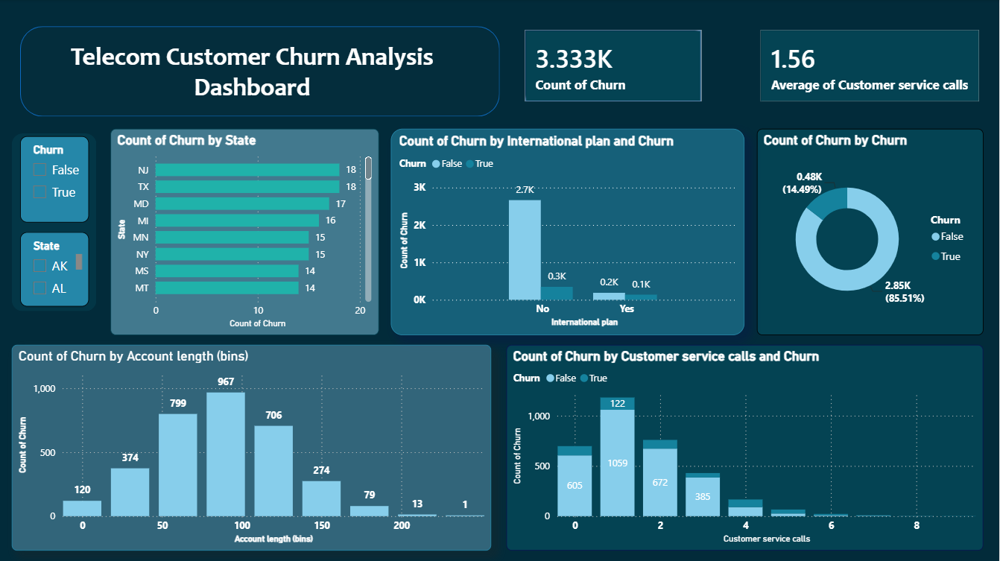

# Telecom Customer Churn Insights & Interactive Analytics Dashboard

An end-to-end data analytics project focused on identifying customer churn patterns, analyzing subscriber lifespans, and evaluating the impact of customer service interactions for a telecommunications provider. This project seamlessly combines **Python** for exploratory data analysis (EDA) and data cleansing with **Power BI** for executive-level business intelligence reporting.

---

## 📊 Project Executive Summary & Dashboard Live Preview
Understanding why customers leave is critical for telecom sustainability. This project aims to diagnose key pain points in customer accounts, explore correlation metrics between operational variables, and present them in a highly optimized interface.

### 🖼️ Dashboard Preview
<!-- عرض صورة الداشبورد مباشرة في واجهة المستودع -->


### 🎯 Key Performance Indicators (KPIs) Captured
* **Total Churn Volume:** 3.33K customers transitioned out.
* **Average Customer Service Calls:** 1.56 calls per account (a critical threshold metric discovered for loyalty prediction).
* **Overall Churn Split:** 14.49% True Churn vs. 85.51% Retained.

---


## 🛠️ Repository Architecture
```bash
├── churn1.png                       # Dashboard Image Preview
├── churn_prep_analysis.py           # Preprocessing & metric profiling script
├── Telecom_Churn_Dashboard.pbix     # Interactive Power BI Dashboard source file
└── README.md                        # Project documentation (You are here)
